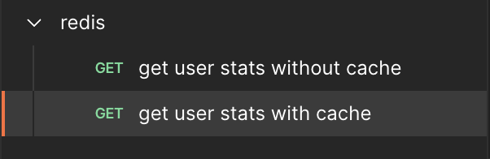
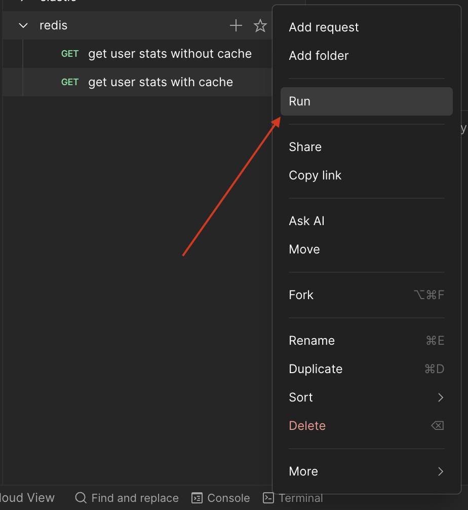
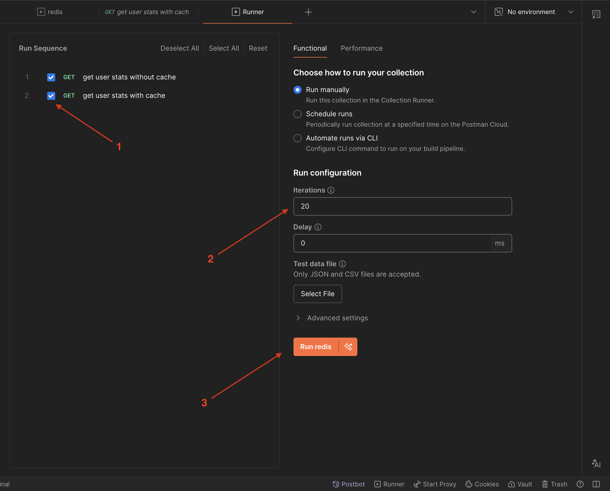
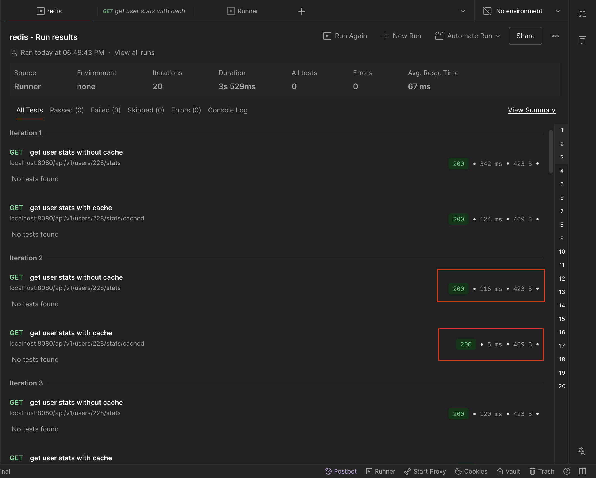
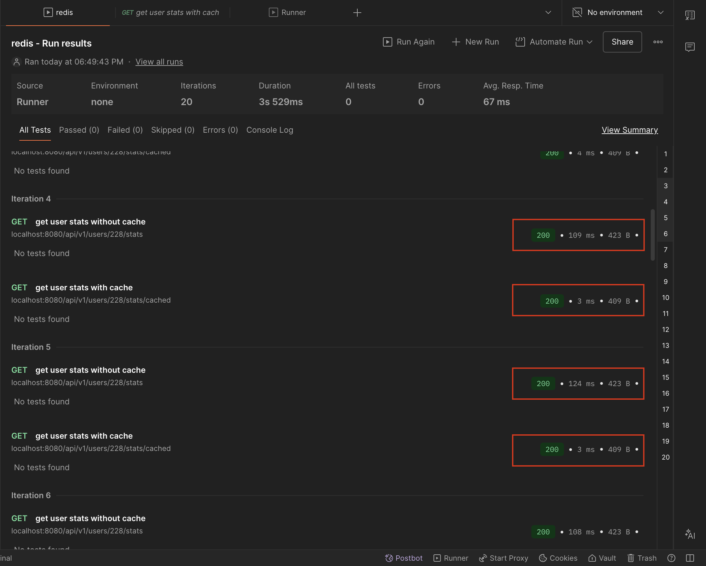

# Redis Demo

Демонстрационный проект для изучения интеграции Redis с Go приложением. Показывает разницу в производительности между запросами с кешированием и без него.

Кешируются два типа данных: **профиль пользователя** (по ID) и **агрегированная статистика по заказам** пользователя. Для статистики используется тяжёлый SQL-запрос (таблица `orders`, CTE, агрегации); специально добавлена задержка `pg_sleep(0.1)`, чтобы наглядно показать выигрыш от кеша: ответ из Redis получается в десятки раз быстрее.

**Откуда берётся статистика:** слой данных `order_repository` считает по таблице заказов агрегаты (число заказов, сумма, средний чек, дата последнего заказа и т.д.) для одного пользователя. Эндпоинты `GET /api/v1/users/:id/stats` (без кеша) и `GET /api/v1/users/:id/stats/cached` (с кешем) вызывают один и тот же расчёт; при попадании в кеш повторные запросы отдаются из Redis без обращения к PostgreSQL.

## Возможности

- **CRUD** по пользователям
- **Кеширование** в Redis: профиль пользователя и статистика по заказам
- **Два варианта** получения: с кешем и без (одни и те же ручки с суффиксом `/cached`)
- **REST API** на Gin
- **PostgreSQL** и **Redis**, миграции (golang-migrate), Docker Compose

## Архитектура

Структура проекта:

```
redis-demo/
├── cmd/server/
│   └── main.go                     # Точка входа, сборка конфига, БД, Redis, роутера
│
├── internal/
│   ├── config/
│   │   ├── config.go               # Загрузка конфига из env
│   │   └── section/
│   │       ├── app.go              # App (ServerPort)
│   │       └── repository.go       # RepositoryPostgres, RepositoryRedis, DSN()
│   │
│   ├── entity/
│   │   ├── user.go                 # User, доменная модель
│   │   └── order.go                # Order, доменная модель
│   │
│   ├── dto/
│   │   ├── user.go                 # CreateUserRequest, UserResponse, FromUser()
│   │   └── stats.go                # UserStatsResponse
│   │
│   ├── handler/
│   │   ├── router.go               # Маршруты Gin, parseUserID()
│   │   ├── health.go
│   │   ├── user_create.go
│   │   ├── user_get.go
│   │   ├── user_list.go
│   │   ├── user_update.go
│   │   ├── user_delete.go
│   │   └── user_stats.go
│   │
│   ├── repository/
│   │   ├── repository.go           # Интерфейсы UserRepository, OrderRepository, UserCacheRepository, UserStatsCacheRepository
│   │   ├── conn/
│   │   │   ├── postgres/conn.go    # NewConn, Client, DB()
│   │   │   └── redis/conn.go       # NewConn, Client (embed *redis.Client), RedisClient()
│   │   ├── user/
│   │   │   ├── user.go             # UserRepository — CRUD по users (Postgres)
│   │   │   ├── user_cache.go       # UserCacheRepository — кеш профиля (Redis)
│   │   │   └── user_stats_cache.go # UserStatsCacheRepository — кеш статистики по заказам (Redis)
│   │   └── order/
│   │       └── order.go            # OrderRepository — GetUserStats(), тяжёлый запрос (Postgres)
│   │
│   └── service/
│       ├── service.go              # Интерфейс UserService
│       └── user.go                 # Реализация UserService (использует user/order/cache репозитории)
│
├── migrations/                   
│   ├── 000001_create_users_table.up.sql
│   ├── 000001_create_users_table.down.sql
│   ├── 000002_add_user_indexes.up.sql
│   ├── 000002_add_user_indexes.down.sql
│   ├── 000003_seed_users.up.sql
│   ├── 000003_seed_users.down.sql
│   ├── 000004_create_orders_table.up.sql
│   └── 000004_create_orders_table.down.sql
│    
├── docker-compose.yml
├── Makefile
├── .env
└── README.md    
```

## Установка и запуск

### 1. Сделайте форк проекта в свой репозиторий

### 2. Клонируйте проект

### 3. Запустите проект

```bash
# Собрать все сервисы
make build

# Запустить все сервисы
make up
```

### 4. Примените миграции БД

```bash
# Применить миграции
make migrate-up
```

### 5. Проверьте, что все сервисы запущены

```bash
docker ps
```

Должно быть 3 контейнера:
- `redis-demo`
- `postgres_db`
- `redis`

**Health check:**

```bash
curl http://localhost:8080/health
```

## API Endpoints

| Метод | Endpoint | Описание |
|-------|----------|----------|
| `POST` | `/api/v1/users` | Создать пользователя |
| `GET` | `/api/v1/users/:id` | Получить пользователя (без кеша) |
| `GET` | `/api/v1/users/:id/cached` | Получить пользователя (с кешем) |
| `GET` | `/api/v1/users` | Получить всех пользователей |
| `PUT` | `/api/v1/users/:id` | Обновить пользователя |
| `DELETE` | `/api/v1/users/:id` | Удалить пользователя |
| `GET` | `/api/v1/users/:id/stats` | Статистика по заказам (без кеша) |
| `GET` | `/api/v1/users/:id/stats/cached` | Статистика по заказам (с кешем) |

## Тестирование - Самостоятельная часть

### Автоматическое тестирование

Запускаем:
```bash
# Сравнение: 5 запросов без кеша + прогрев кеша + 5 запросов с кешем (статистика по пользователю)
make benchmark
```

Ожидаемый результат: запросы из кеша должны быть на порядок быстрее.

```
=== GET /api/v1/users/1/stats (без кеша) — 5 запросов ===
  запрос 1: 0.305475s
  запрос 2: 0.114589s
  запрос 3: 0.113669s
  запрос 4: 0.116733s
  запрос 5: 0.116177s
=== Прогрев кеша (1 запрос) ===
  время прогрева: 0.139982s
=== GET /api/v1/users/1/stats/cached — 5 запросов из Redis ===
  запрос 1: 0.009801s
  запрос 2: 0.002816s
  запрос 3: 0.003721s
  запрос 4: 0.003836s
  запрос 5: 0.003705s
```

### Сравнение производительности через Postman

1. **Создайте коллекцию в Postman** с двумя запросами:

   **Запрос 1: Без кеша**
   ```
   GET localhost:8080/api/v1/users/228/stats
   ```

   **Запрос 2: С кешем**
   ```
   GET http://localhost:8080/api/v1/users/228/stats/cached
   ```



2. **Выберите вашу коллекцию и нажмите "Run"**


3. **Настройте Runner в Postman**:
   - Проставьте галочки для обоих вызовов внутри Runner
   - Установите **Iterations: 20** (20 запросов)
   - Установите **Delay: 0ms** (без задержки)
   - Нажмите "Run Redis"



4. **Сравните результаты**:
   - **Без кеша**: каждый запрос идет в PostgreSQL
   - **С кешем**: первый запрос в БД, остальные из Redis
   - Время выполнения будет значительно отличаться.





Ожидаемые результаты:
- **Без кеша**: 100-200ms на каждый запрос
- **С кешем**: первый запрос 100-200ms, все последующие по 1-5ms на запрос

### Работа с redis-cli

Теорию по командам redis-cli вы уже прошли. Здесь описано — **когда и как** потыкаться в CLI именно в этом проекте.

**Когда:** после того как подняли сервисы (`make up`) и хотя бы раз запустили приложение и сделали запросы с кешем. Тогда в Redis появятся ключи, которые пишет наше приложение.

**Как подключиться.** В этом проекте Redis в Docker слушает порт **6379** на хосте (см. `docker-compose.yml`). Варианты:

- С хоста (если установлен redis-cli):
  ```bash
  redis-cli -p 6379
  ```
- Из контейнера:
  ```bash
  docker exec -it redis redis-cli
  ```
  Тогда порт указывать не нужно (внутри контейнера по умолчанию 6379).

**Что посмотреть по шагам.**

1. **Проверка связи**
   ```bash
   PING
   ```
   Ожидается ответ `PONG`.

2. **Список ключей** (сначала кеш может быть пустым)
   ```bash
   KEYS *
   ```
   После запросов к API появятся ключи вида `user:1`, `user_stats:1` и т.д. — по одному на каждого запрашиваемого пользователя и его статистику.

3. **Содержимое кеша пользователя**
   ```bash
   GET user:1
   ```
   Вернётся JSON профиля пользователя (как хранит приложение). Можно вызвать, например, `GET http://localhost:8080/api/v1/users/1/cached`, затем снова `GET user:1` в redis-cli — увидите те же данные.

4. **Время жизни ключа**
   ```bash
   TTL user:1
   TTL user_stats:1
   ```
   Для пользователя приложение ставит TTL 5 минут, для статистики — 10 минут. Увидите оставшееся число секунд (или `-1`, если TTL по какой-то причине не установлен).

5. **Ручная инвалидация**
   ```bash
   DEL user:1
   ```
   После этого следующий запрос `GET /api/v1/users/1/cached` снова пойдёт в БД и запишет ключ заново. Так можно убедиться, что приложение действительно читает и пишет в Redis.

**Итог:** на этапе "проект поднят, приложение хотя бы раз отдало ответы с кешем" — подключайтесь к redis-cli и посмотрите ключи `user:*`, `user_stats:*`, их значения и TTL. 

